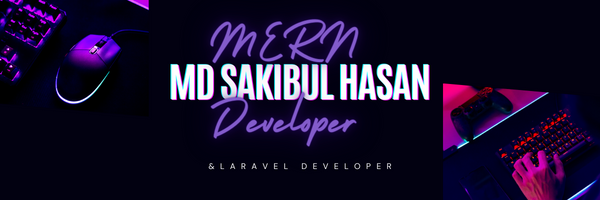

## Hey! Welcome,

<!--  -->

- 👋 Hi, I’m Md Sakibul Hasan 
- 👀 I’m interested in Programming. 
- 🌱I’m currently working as a   MERN    stack and Laravel developer.
- 📫 sakibbangla49@gmail.com

## 📫 Description 
 **As a MERN stack developer, I am proficiently leverage MongoDB, Express.js, React.js, and Node.js to build dynamic and scalable web applications. My expertise lies in crafting seamless, full-stack solutions with efficiency and innovation. I am expert in HTML,  CSS, Tailwind, Bootstrap, Daisyui, Javascript, jQuery, REACT, Nodejs, Expressjs, Mongodb, php, Laravel, Ajax, mysql, Figma, Git, Github.**

<!---
Sakibgithub123/Sakibgithub123 is a ✨ special ✨ repository because its `README.md` (this file) appears on your GitHub profile.
You can click the Preview link to take a look at your changes.
--->
